# Implementation-of-Line-encoding-and-Error-Detection-Codes-in-Python

## LINE ENCODING SCHEMES ##

### AIM ### 

To implement the various line encoding schemes and to create a command line program and a GUI based web application for the same. 

### THEORY ###  

- Line coding is the process of converting digital data to digital signals.  
- By this technique we converts a sequence of bits to a digital signal.  
- At the sender side digital data are encoded into a digital signal and at the receiver side the digital data are recreated by decoding the digital signal 

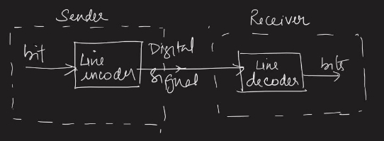

- Line Encoding Schemes can be divided into the following categories namely 
- Unipolar – NRZ 
- Polar 
  - NRZ-L 
  - NRZ-I 
  - Bi-phase Manchester 
  - Differential Manchester 
- Bipolar 
  - AMI 
  - Pseudoternary 
- The following are the desired characteristics of line encoding schemes 
- There  should  be **self-synchronizing** i.e.,  both  receiver  and sender clock should be synchronized 
- There should have some error-detecting capability 
- There should be immunity to noise and interference 
- There should be less complexity 
- There should be no low frequency component (**DC-component**) as  long  distance  transfer  is  not  feasible  for  low  frequency component signal 
- There should be less base line wandering 

#### UNIPOLAR-NRZ ####

It is unipolar line coding scheme in which positive voltage defines bit 1 and the zero voltage defines bit 0.  

Signal does not return to zero at the middle of the bit thus it is called NRZ.  

For example: Data = 10110. 

But this scheme uses more power as compared to polar scheme to send one bit per unit line resistance. Moreover for continuous set of zeros or ones there will be self-synchronization and base line wandering problem. 

#### POLAR-SCHEMES ####

In polar schemes, the voltages are on the both sides of the axis. 

**NRZ-L and NRZ-I**  

These are somewhat similar to unipolar NRZ scheme but here we use two levels of amplitude (voltages).  

For **NRZ-L (NRZ-Level)**, the level of the voltage determines the value of the bit, typically binary 1 maps to logic-level high, and binary 0 maps to logic-level low. 

For **NRZ-I (NRZ-Invert)**, two-level signal has a transition at a boundary if the next bit that we are going to transmit is a logical 1, and does not have a transition if the next bit that we are going to transmit is a logical 0. ***Note –** For NRZ-I we are assuming in the example that previous signal before starting of data set “01001110” was positive. Therefore, there is no transition at the beginning and first bit “0” in current data set “01001110” is starting from +V. Example: Data = 01001110.* 

**Comparison between NRZ-L and NRZ-I**:  

- Baseline wandering is a problem for both of them, but for NRZ-L it is twice as bad as compared to NRZ-I.  
- This is because of transition at the boundary for NRZ-I (if the next bit that we are going to transmit is a logical 1).  
- Similarly self-synchronization problem is similar in both for long sequence of 0’s, but for long sequence of 1’s it is more severe in NRZ-L. 
- **Return to zero (RZ)** 

` `One solution to NRZ problem is the RZ scheme, which uses three values positive, negative, and zero. In this scheme signal goes to 0 in the middle of each bit. 

***Note –** The logic we are using here to represent data is that for bit 1 half of the signal is represented by +V and half by zero voltage and for bit 0 half of the signal is represented by -V and half by zero voltage. Example: Data = 01001.* 

**Disadvantages** 

- Main disadvantage of RZ encoding is that it requires greater bandwidth. Another problem is the complexity as it uses three levels of voltage.  
- As a result of all these deficiencies, this scheme is not used today. 
- Instead, it has been replaced by the better-performing Manchester and differential Manchester schemes. 
- **Biphase (Manchester and Differential Manchester )** 
  - **Manchester encoding** is somewhat combination of the RZ (transition at the middle of the bit) and NRZ-L schemes.  
  - The duration of the bit is divided into two halves.  
  - The voltage remains at one level during the first half and moves to the other level in the second half.  
  - The transition at the middle of the bit provides synchronization. 
  - **Differential Manchester** is somewhat combination of the RZ and NRZ- I schemes.  
  - There is always a transition at the middle of the bit but the bit values are determined at the beginning of the bit.  
  - If the next bit is 0, there is a transition, if the next bit is 1, there is no transition. 

***Note  –*** 

1. *The logic we are using here to represent data using Manchester is that for bit 1 there is transition form -V to +V volts in the middle of the bit and for bit  0  there  is  transition  from  +V  to  -V  volts  in  the  middle  of  the  bit.* 
1. *For  differential  Manchester  we  are  assuming  in  the  example  that previous signal before starting of data set “010011” was positive. Therefore there is transition at the beginning and first bit “0” in current data set “010011” is starting from -V. Example: Data = 010011.* 

**Problems solved** 

- The Manchester scheme overcomes several problems associated with NRZ-L,  and  differential  Manchester  overcomes  several  problems associated with NRZ-I as there is no baseline wandering and no DC component  because  each  bit  has  a  positive  and  negative  voltage contribution. 
- Only  limitation  is  that  the  minimum  bandwidth  of  Manchester  and differential Manchester is twice that of NRZ. 

### Bipolar-scheme s###  

In this scheme there are three voltage levels positive, negative, and zero. The voltage level for one data element is at zero, while the voltage level for the other element alternates between positive and negative. 

- **Alternate Mark Inversion (AMI) –** A neutral zero voltage represents binary 
  - Binary 1’s are represented by alternating positive and negative voltages. 
- **Pseudoternary –** Bit 1 is encoded as a zero voltage and the bit 0 is encoded as alternating positive and negative voltages i.e., opposite of AMI scheme. 
- *Example:Data=010010*. 

***Note*** 

*The bipolar scheme is an alternative to NRZ.This scheme has the same signal rate as NRZ,but there is no DC component as one bit is represented by voltage zero and other alternates every time* 

**IMPLEMENTATION *IN PYTHON* UNIPOLAR – NRZ** 

**Function definition** 

**POLAR NRZ-L Function definition** 

**POLAR NRZ-I Function definition** 

**POLAR RZ Function definition** 

**BIPHASE MANCHESTER Function Definition** 

**DIFFERENTIAL MANCHESTER Function Definition** 

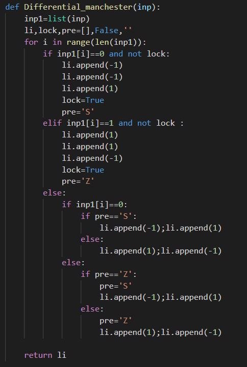

**ALERNATE MARK INVERSION Function definition** 

**PSEUDOTERNARY Function definition** 

**Screenshot of formatted test code** 

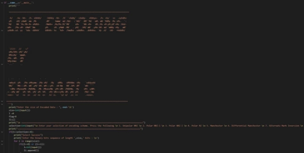

**DEMO Entering size of data as 8 bits** 

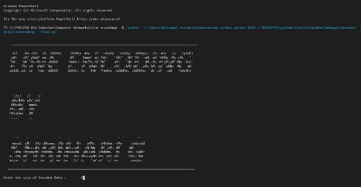

**Selecting for option 8 – All encoding schemes** 

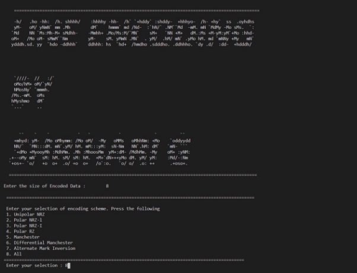

**Entering data**  

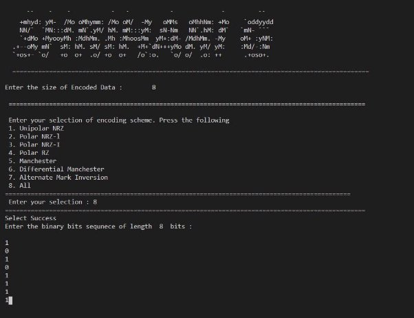

**Output** 

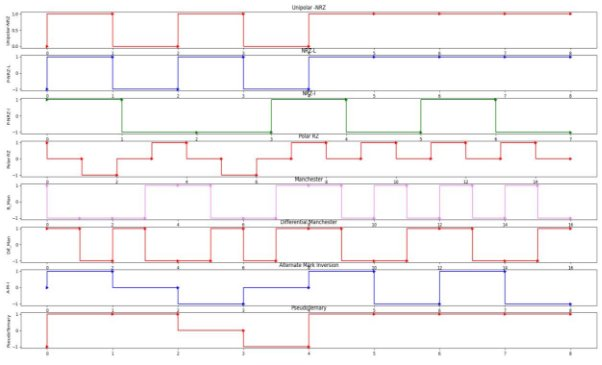

**EXCEPTION HANDLING Case 1: Size of data stream is not an integer** 

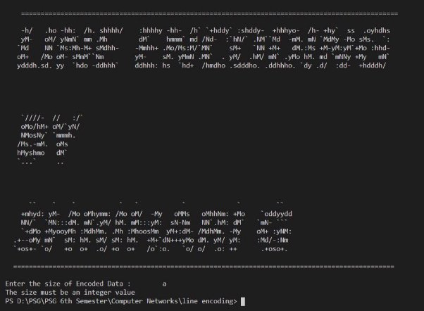

**Case 2: Invalid selection for encoding scheme** 

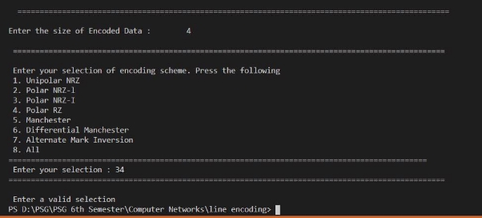

**Case 3: Input data is not binary** 

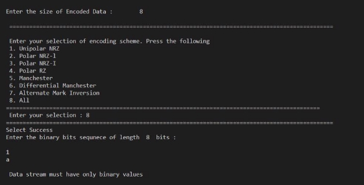

**IMPLEMENTATION WITH GUI AS WEB APPLICATION** 

- *The line encoding schemes are implemented in the form of a GUI with a web interface* 
- *The front end used is HTML and CSS (Bootstrap for themes)* 
- *The back end used Is Javascript* 
- *The web-application has been deployed on my web-server* 
- *The source codes and the application can be found at* 
  - [***https://shrihari.ml/lineencoding*** ](https://shrihari.ml/lineencoding)

**HOMEPAGE** 

**SELECTING FOR POLAR ENCODING SCHEMES** 

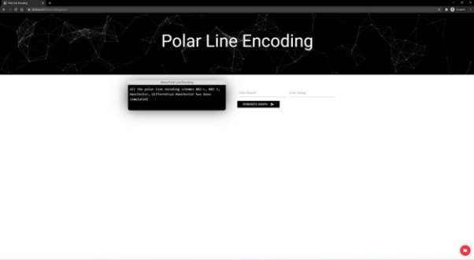

**OUTPUT** 

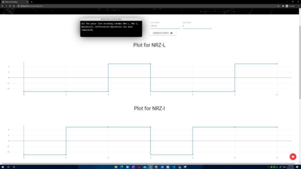

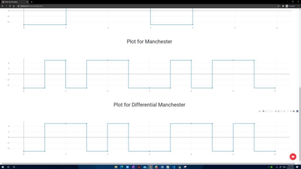

**LINE ENCODING SCHEMES – REPORT PAGE3**  NUMPAGES26 

**SOURCE CODE – JAVASCRIPT – FOR BIPOLAR ENCODING** 

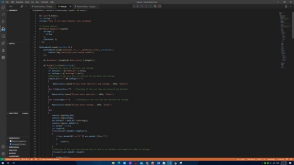

Due to the size of the .js, .css and .html files, source code is available in  

Shrihari.ml/lineencoding   ( Ctrl+Shift+I in Google Chrome) 

- Web application : [https://shrihari.ml/lineencoding](https://shriharig.tk/lineencoding)

